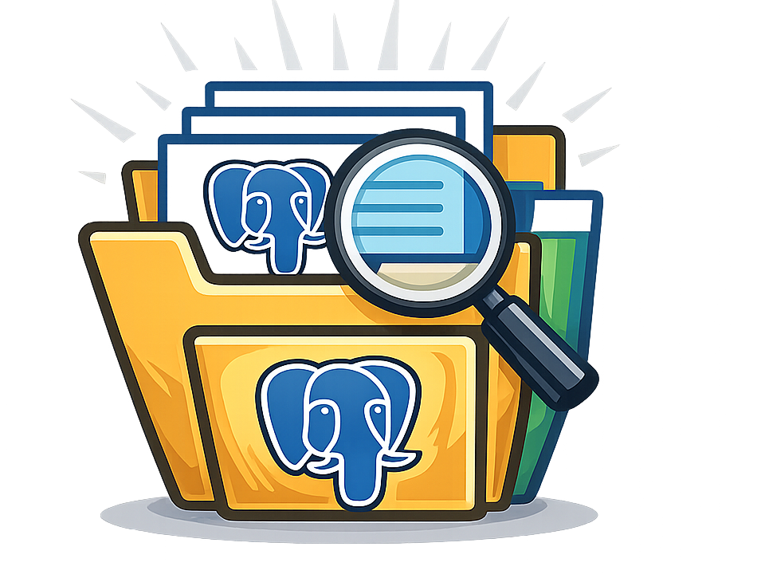

<p align="center">
  
</p>

<h1 align="center">pg-slide-harvester</h1>

<p align="center">
  A lightweight PostgreSQL conference slide harvester and topic-based local archive.
  <br>
  自动发现、下载并按主题整理 PostgreSQL 生态会议公开 PPT/PDF 资料。
</p>

<p align="center">
  <a href="#english">English</a> ·
  <a href="#中文说明">中文</a> ·
  <a href="#quick-start">Quick Start</a> ·
  <a href="#快速开始">快速开始</a> ·
  <a href="#reports">Reports</a> ·
  <a href="#报告">报告</a> ·
  <a href="#development">Development</a> ·
  <a href="#开发">开发</a> ·
  <a href="#license">License</a>
</p>

<p align="center">
  
  
  
  
</p>

---

## English

### Overview

`pg-slide-harvester` is a small command-line tool for building a local archive
of public PostgreSQL conference materials. It discovers events, follows
conference pages, downloads public PDF/PPT/PPTX/ODP assets, and stores them by
topic instead of by event.

It is designed for PostgreSQL users who want a practical archive of talks
without repeatedly opening event websites, checking whether slides have been
published, downloading files one by one, and renaming cryptic filenames by hand.

### Highlights

- Discover PostgreSQL events from `postgresql.org`.
- Download slides by event name after discovery.
- Store files directly under topic folders, such as `archive/optimizer/`.
- Classify topics primarily from session/page abstracts.
- Keep event metadata in SQLite and generated reports for traceability.
- Normalize filenames from talk titles, for example:
  `Update-on-index-prefetching.pdf` -> `Update on index prefetching.pdf`.
- Re-check sessions whose materials are published later.
- Generate local HTML and CSV reports.
- Generate one dated run report for each download command.
- Use only the Python standard library.

### Supported Sources

Current adapters include:

- `pgevents.ca`, such as PGConf.dev.
- Indico-based events, such as CERN PGDay.
- WordPress-based conference websites.
- A generic fallback crawler for independent event websites.

PostgreSQL conference websites vary a lot, so the project grows adapter by
adapter as new platforms are encountered.

### Quick Start

```bash
python3 -m pip install -e .
pgsh init
pgsh scan-official
pgsh list events
pgsh download-event "CERN PGDay 2026"
pgsh report
```

You can also run the script directly without installing it:

```bash
python3 pgppt.py init
python3 pgppt.py scan-official
python3 pgppt.py list events
python3 pgppt.py download-event "CERN PGDay 2026"
python3 pgppt.py report
```

Generated local artifacts:

```text
archive/optimizer/
archive/executor/
archive/streaming-replication/
archive/backup-recovery/
archive/non-english/russian/backup-recovery/
archive/uncategorized/
data/pgppt.sqlite
reports/index.html
reports/index.csv
reports/runs/2026-07-14/pgconf.dev-2026-run-12.html
reports/runs/2026-07-14/pgconf.dev-2026-run-12.csv
```

Local archives, reports, and SQLite state are ignored by git.

To keep data outside the source checkout, set `PGSH_HOME`:

```bash
PGSH_HOME=/path/to/pg-slide-archive pgsh init
```

Editable installation uses the standard Python build backend. If your Python
environment does not include `setuptools`, install it first or use the direct
`python3 pgppt.py ...` form.

### Common Commands

```bash
# Initialize local folders and SQLite state.
python3 pgppt.py init

# Discover events from the official PostgreSQL event pages.
python3 pgppt.py scan-official

# List discovered events.
python3 pgppt.py list events

# Download slides by event name.
python3 pgppt.py download-event "PGConf.dev 2026"

# Download a single PDF/PPT/PPTX/ODP asset.
python3 pgppt.py ingest <asset-url>

# Scan a single page for slide links.
python3 pgppt.py ingest <page-url> --event "Event Name" --title "Session Title"

# Check sessions whose next check time is due.
python3 pgppt.py tick

# Regenerate reports.
python3 pgppt.py report

# Move older downloaded files into topic directories.
python3 pgppt.py organize-archive

# Inspect local state.
python3 pgppt.py list assets
python3 pgppt.py list sessions
```

### Reports

The project generates two kinds of reports:

| Report | Path | Meaning |
| --- | --- | --- |
| Full snapshot | `reports/index.html`, `reports/index.csv` | Current complete SQLite state. Regenerated and overwritten on each report-producing command. |
| Run report | `reports/runs/<date>/<event>-run-<id>.html`, `.csv` | One dated report for a single download run. Shows what that run downloaded or touched. |

Run reports are created by download-oriented commands such as `download-event`,
`ingest`, `crawl-pgevents`, `crawl-generic`, and `tick`.

Each run report includes the run command, date, action, message, event, session,
tags, local file path, source URL, size, and timestamps. Actions include
`downloaded`, `already_exists`, and `duplicate_content`, so you can distinguish
newly downloaded files, previously downloaded files, and duplicate URLs or files.

### Topic Archive

Downloaded files are stored under `archive/<category>/`, not grouped by event.
Classification primarily uses the session/page abstract, with the title as a
secondary signal. Event names are not used for keyword scoring.

Non-English materials are separated from the main English archive and keep the
same topic structure under `archive/non-english/<language>/<category>/`, for
example `archive/non-english/russian/backup-recovery/`.

Built-in categories include:

| Category | Purpose |
| --- | --- |
| `optimizer` | Planner, cost model, statistics, join order |
| `executor` | Query execution, executor nodes, parallel query |
| `streaming-replication` | Physical replication, standby, WAL sender/receiver |
| `logical-replication` | Logical decoding, publication/subscription, CDC |
| `backup-recovery` | Backup, restore, PITR, pgBackRest, Barman |
| `high-availability` | Failover, Patroni, repmgr, disaster recovery |
| `performance` | Benchmarking, latency, throughput, tuning |
| `operations` | Monitoring, maintenance, upgrades, SRE workflows |
| `storage` | Heap, buffers, pages, freezing, checkpoints |
| `internals` | MVCC, locks, WAL, transactions, shared memory |
| `extensions-ecosystem` | Extensions, PostGIS, pgvector, FDWs |
| `community` | Contributor experience, training, onboarding |
| `cloud-native` | Kubernetes, operators, containers, CloudNativePG |
| `security` | Authentication, authorization, TLS, audit |

Files without a confident match are stored under `archive/uncategorized/`.
After improving `config/categories.json`, run:

```bash
python3 pgppt.py classify
python3 pgppt.py organize-archive
```

### Filename Policy

Downloaded files are named from the talk/session title whenever possible.

```text
Semi Joins in Postgres.pdf
Update on index prefetching.pdf
PostgreSQL Backup Patterns - Demo Notes.pdf
```

The filename sanitizer handles special characters, repeated whitespace, trailing
dots/spaces, long titles, duplicate filenames, and common URL-style slugs.

### Delayed Publication

Many conferences publish slides days or weeks after the event. Each session is
tracked with a status:

- `missing`: no public material found yet.
- `found`: material link found.
- `downloaded`: file downloaded.
- `duplicate_content`: URL or file content already exists under another asset.
- `downloaded_without_asset`: defensive report-only status for old metadata that
  says downloaded but has no local asset row.
- `failed`: download failed.
- `login_required`: login or permission required.

For recurring checks:

```bash
python3 pgppt.py tick
python3 pgppt.py report
```

### Principles

- Download only publicly available materials.
- Do not bypass authentication, permissions, or paywalls.
- Be polite to conference websites.
- Keep generated archives, reports, and SQLite state out of version control.
- Prefer small dedicated adapters over one fragile universal crawler.

### Roadmap

- Add more PostgreSQL conference platform adapters.
- Improve PGConf.EU/PostgreSQL Europe support.
- Improve topic classification.
- Add optional recurring job setup instructions.
- Expand automated tests.

### Development

Run the local checks:

```bash
python3 -m py_compile pgppt.py
python3 -m pip install -e .
pgsh --help
pg-slide-harvester --help
python3 -m unittest discover -s tests -v
```

The repository also includes GitHub Actions CI for these checks across multiple
Python versions, including the console entry points.

---

## 中文说明

### 项目简介

`pg-slide-harvester` 是一个轻量级命令行工具，用于自动发现、下载和整理
PostgreSQL 生态会议中的公开 PPT/PDF 资料。它会从 PostgreSQL 官方活动列表
和会议官网中发现资料链接，下载公开的 PDF/PPT/PPTX/ODP 文件，并按主题分类
保存到本地目录。

这个项目关注一个非常实际的需求：不用反复打开会议网站，不用手动检查资料是否
已经发布，不用逐个下载，也不用再面对一堆缩写或 URL slug 风格的文件名。

### 核心特性

- 从 `postgresql.org` 官方活动页发现 PostgreSQL 相关会议。
- 支持按会议名称下载，例如：
  `python3 pgppt.py download-event "CERN PGDay 2026"`。
- 资料直接按主题保存，例如 `archive/optimizer/`。
- 分类优先基于 session/页面简介，标题作为辅助信号。
- SQLite 和报告中保留会议信息，方便溯源。
- 文件名使用演讲标题并自动美化，例如：
  `Update-on-index-prefetching.pdf` -> `Update on index prefetching.pdf`。
- 对暂未发布资料的 session 进行记录，后续可以继续补抓。
- 生成本地 HTML/CSV 报告。
- 每次下载命令都会生成一份按日期保存的运行报告。
- 只使用 Python 标准库。

### 当前支持的来源

- `pgevents.ca`，例如 PGConf.dev。
- Indico 会议系统，例如 CERN PGDay。
- WordPress 会议官网。
- 通用会议网站扫描器，用于尝试识别独立站点中的资料链接。

不同 PostgreSQL 会议使用的网站系统差异很大，本项目采用逐步补 adapter 的
方式：遇到新的会议平台，就为它补一个小而稳定的抓取逻辑。

### 快速开始

```bash
python3 -m pip install -e .
pgsh init
pgsh scan-official
pgsh list events
pgsh download-event "CERN PGDay 2026"
pgsh report
```

也可以不安装，直接运行脚本：

```bash
python3 pgppt.py init
python3 pgppt.py scan-official
python3 pgppt.py list events
python3 pgppt.py download-event "CERN PGDay 2026"
python3 pgppt.py report
```

常用目录：

```text
archive/optimizer/
archive/executor/
archive/streaming-replication/
archive/backup-recovery/
archive/non-english/russian/backup-recovery/
archive/uncategorized/
data/pgppt.sqlite
reports/index.html
reports/index.csv
reports/runs/2026-07-14/pgconf.dev-2026-run-12.html
reports/runs/2026-07-14/pgconf.dev-2026-run-12.csv
```

本地归档、报告和 SQLite 状态默认不会提交到 git。

如果希望把数据放到源码目录之外，可以设置 `PGSH_HOME`：

```bash
PGSH_HOME=/path/to/pg-slide-archive pgsh init
```

可编辑安装使用标准 Python 构建后端。如果你的 Python 环境缺少 `setuptools`，
可以先安装它，或者继续使用 `python3 pgppt.py ...` 的直接运行方式。

### 常用命令

```bash
# 初始化本地目录和 SQLite 状态
python3 pgppt.py init

# 从 PostgreSQL 官方活动页发现会议
python3 pgppt.py scan-official

# 查看已发现会议
python3 pgppt.py list events

# 通过会议名称下载资料
python3 pgppt.py download-event "PGConf.dev 2026"

# 下载单个 PDF/PPT/PPTX/ODP
python3 pgppt.py ingest <asset-url>

# 扫描单个页面中的资料链接
python3 pgppt.py ingest <page-url> --event "Event Name" --title "Session Title"

# 检查到期的 session，适合定期运行
python3 pgppt.py tick

# 重新生成报告
python3 pgppt.py report

# 将旧版本下载到其他目录的资料迁移到主题目录
python3 pgppt.py organize-archive

# 查看本地资料和 session 状态
python3 pgppt.py list assets
python3 pgppt.py list sessions
```

### 报告

项目会生成两类报告：

| 报告 | 路径 | 含义 |
| --- | --- | --- |
| 全量快照 | `reports/index.html`、`reports/index.csv` | 当前 SQLite 状态库的完整视图。每次重新生成时会覆盖旧文件。 |
| 运行报告 | `reports/runs/<date>/<event>-run-<id>.html`、`.csv` | 单次下载运行的独立清单，按日期和 event 保存。 |

运行报告会由下载类命令自动生成，例如 `download-event`、`ingest`、
`crawl-pgevents`、`crawl-generic` 和 `tick`。

每份运行报告包含本次命令、日期、动作、消息、会议、session、分类、文件路径、
源 URL、文件大小和时间戳。动作包括 `downloaded`、`already_exists`、
`duplicate_content`，因此可以区分“今天新下载的文件”、“本地之前已经存在的文件”
和“重复 URL/重复内容”。

### 主题归档

下载资料会进入 `archive/<category>/`，而不是按会议分散保存。分类优先使用
session 页面或会议系统中的简介/摘要，其次才使用标题。会议名称不会参与关键词
打分，避免把整场会议误判成某一个主题。

非英语资料会从英文主归档中单独拆出来，并继续保留主题目录结构，路径为
`archive/non-english/<language>/<category>/`，例如
`archive/non-english/russian/backup-recovery/`。

内置主题包括：

| 分类 | 说明 |
| --- | --- |
| `optimizer` | 优化器、planner、cost、statistics、join order |
| `executor` | 执行器、query execution、executor node、parallel query |
| `streaming-replication` | 流复制、物理复制、standby、WAL sender/receiver |
| `logical-replication` | 逻辑复制、logical decoding、publication/subscription、CDC |
| `backup-recovery` | 备份、恢复、PITR、pgBackRest、Barman |
| `high-availability` | 高可用、failover、Patroni、repmgr、容灾 |
| `performance` | 性能、benchmark、latency、throughput、tuning |
| `operations` | 监控、维护、升级、迁移、SRE |
| `storage` | 存储、heap、buffer、page、freezing、checkpoint |
| `internals` | MVCC、锁、WAL、事务、shared memory |
| `extensions-ecosystem` | 扩展、PostGIS、pgvector、FDW |
| `community` | 贡献者经验、培训、onboarding、社区内容 |
| `cloud-native` | Kubernetes、operator、容器、CloudNativePG |
| `security` | 认证、授权、TLS、审计 |

暂未命中分类的资料会放入 `archive/uncategorized/`。完善
`config/categories.json` 后，可以重新分类和迁移：

```bash
python3 pgppt.py classify
python3 pgppt.py organize-archive
```

### 文件命名策略

下载文件会优先使用 session 或页面标题，而不是 URL 中的缩写文件名。

```text
Semi Joins in Postgres.pdf
Update on index prefetching.pdf
PostgreSQL Backup Patterns - Demo Notes.pdf
```

命名时会自动处理特殊字符、多余空格、尾部点号、超长标题、同名文件，以及常见
URL slug 风格的连字符/下划线。

### 延迟发布资料

很多会议不会在活动当天立即发布 PPT。本工具会为每个 session 维护状态：

- `missing`：暂未发现资料。
- `found`：已发现资料链接。
- `downloaded`：已下载。
- `duplicate_content`：URL 或文件内容已经作为另一份资产存在。
- `downloaded_without_asset`：报告中的防御性状态，用于提示旧元数据里显示
  downloaded，但没有对应本地资产记录。
- `failed`：下载失败。
- `login_required`：需要登录或没有权限。

可以定期运行：

```bash
python3 pgppt.py tick
python3 pgppt.py report
```

### 设计原则

- 只下载公开可访问的会议资料。
- 不绕过登录、权限或付费限制。
- 对会议网站保持温和访问，避免高频请求。
- 本地归档、数据库和报告不进入版本控制。
- 优先使用小而明确的 adapter，而不是脆弱的大而全爬虫。

### 路线图

- 支持更多 PostgreSQL 会议平台。
- 增强 PGConf.EU/PostgreSQL Europe 等站点 adapter。
- 改进主题分类质量。
- 增加可选的定时任务安装说明。
- 增加更完整的测试覆盖。

### 开发

本地检查命令：

```bash
python3 -m py_compile pgppt.py
python3 -m pip install -e .
pgsh --help
pg-slide-harvester --help
python3 -m unittest discover -s tests -v
```

仓库已包含 GitHub Actions CI，会在多个 Python 版本上运行同样的检查，
包括 console entrypoint。

## License

MIT
